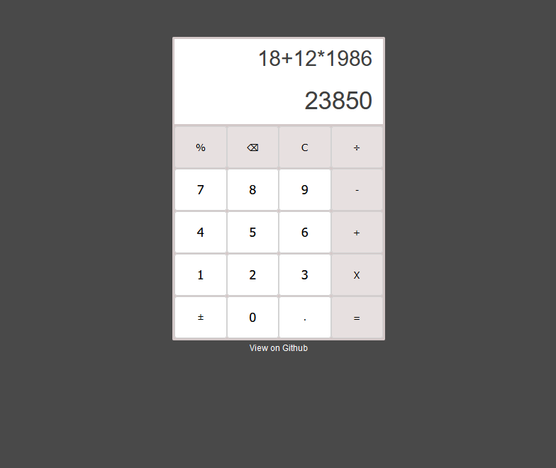

# A simple calculator
---

Une simple calculatrice codée en HTML, CSS et Javascript.

## Objectives
---

C'est mon premier projet Javascript et j'en suis fier ! La calculatrice peut :

- effectuer les opérations de base (addition, soustraction, multiplication et division),
- utiliser l'opérateur % ou modifier le signe de l'opération en cours (+ ou -),
- rafraichir l'écran de résultat ou supprimer le dernier chiffre,
- indiquer si l'utilisateur a fait une erreur de saisi avec un emoji tout mignon !

## Technologies used :
---

- HTML
- CSS
- Javascript
